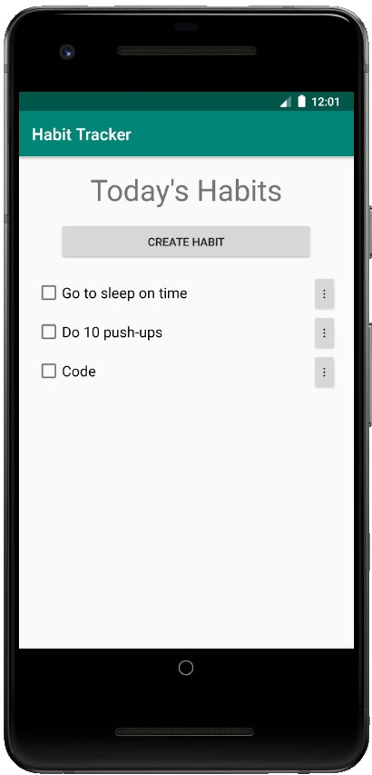
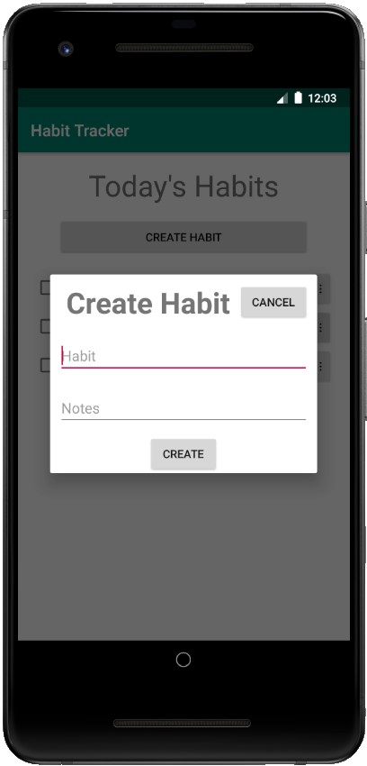
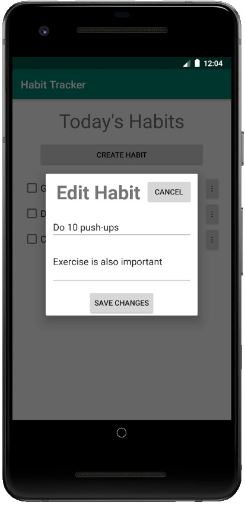
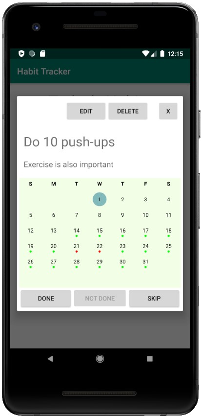

# HabitTracker
Android app for tracking habits.

Current features
* Create a habit
* Add notes to a habit
* Edit an existing habit
* Mark a habit as done
* See which days habits were completed or skipped via a mini-calendar

Note that this app may be used with or without a backend, which can be toggled by changing the `useBackend` flag in MainActivity, but that certain features, such as the mini-calendar habit tracker, may not function without a backend.

The backend for this app can be found [here](https://github.com/Shiyuan-Huang-23/habit_tracker_backend).

The library used for the mini-calendar can be found [here](https://github.com/SundeepK/CompactCalendarView).

## Homepage

## Create Habit

## Edit Habit

## Habit Information

